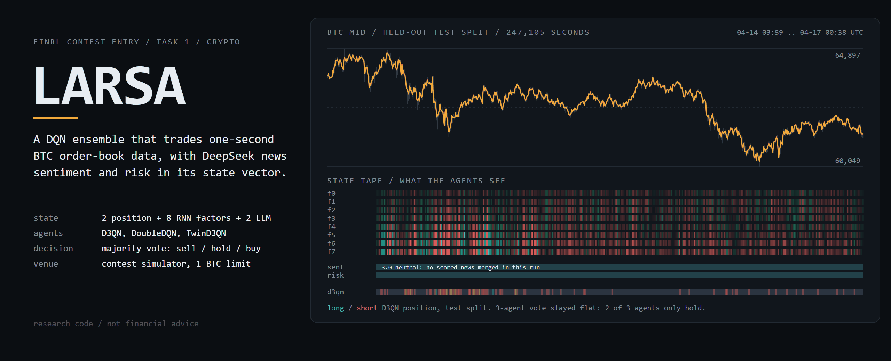
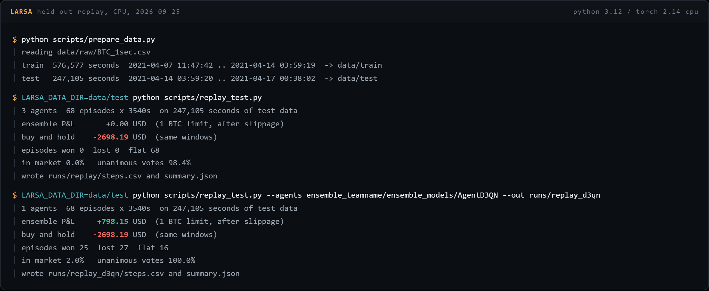
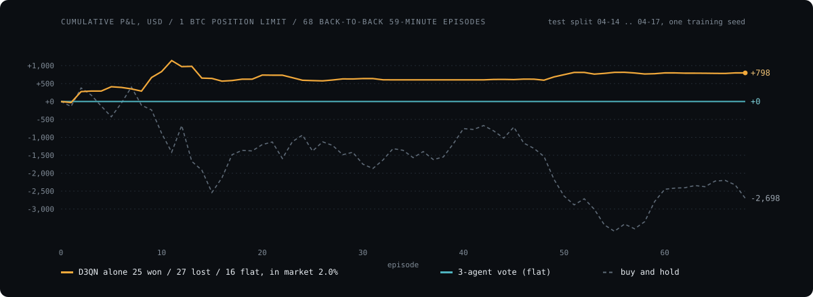
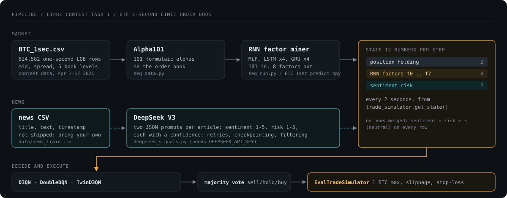

<picture>
  <source media="(prefers-color-scheme: light)" srcset="assets/hero-light.png">
  
</picture>

**LARSA** (LLM-Augmented Regime-Switching Agent) is an entry for Task 1 of the FinRL contest: a small ensemble of DQN agents that trades Bitcoin on one-second limit-order-book data. Each agent sees 12 numbers every 2 seconds: its own position, 8 factors from an RNN trained on 101 formulaic alphas, and 2 news signals (sentiment and risk, 1 to 5) that DeepSeek V3 extracts from headlines. The agents vote sell, hold or buy, and the contest's market-replay simulator executes the vote.

[](https://github.com/mattbusel/FinRL_DeepSeek_Crypto_Trading/actions/workflows/ci.yml)

> [!WARNING]
> **Research code, not financial advice.** Nothing here has been tested with real money, and the results below come from one training seed on nine days of 2021 data. Crypto trading can lose all of the capital you put in.

## Quick start

Runs on a laptop CPU. The market data is public: the contest organisers host it on Google Drive (1.4 GB).

```bash
git clone https://github.com/mattbusel/FinRL_DeepSeek_Crypto_Trading
cd FinRL_DeepSeek_Crypto_Trading
pip install torch --index-url https://download.pytorch.org/whl/cpu
pip install numpy pandas scipy matplotlib pydantic pydantic-settings pyyaml openai gdown

# 1. download BTC_1sec.csv + BTC_1sec_predict.npy, split 70/30 in time
python scripts/prepare_data.py --download --source data/raw

# 2. train D3QN, DoubleDQN and TwinD3QN on the first 70%  (about 30 min on CPU)
LARSA_DATA_DIR=data/train NUM_SIMS=256 RL_BREAK_STEP=60000 python task1_ensemble.py

# 3. replay the ensemble over the last 30%, hour by hour
LARSA_DATA_DIR=data/test python scripts/replay_test.py
```

On Windows PowerShell set the variables with `$env:LARSA_DATA_DIR = "data/train"` first. Without a news file every row gets the neutral LLM signal 3 (see [News signals](#news-signals)).

## What a run looks like

This is the real output of the three commands above, run on 2026-09-25 (Python 3.12, torch 2.14 CPU):





What the numbers say, and what they do not:

| | P&L, USD per 1 BTC limit | Episodes won / lost / flat | Time in market |
|---|---:|---|---:|
| 3-agent majority vote | 0.00 | 0 / 0 / 68 | 0.0% |
| D3QN on its own | +798.15 | 25 / 27 / 16 | 2.0% |
| Buy and hold, same windows | -2,698.19 | | 100% |

- **The ensemble never traded.** DoubleDQN and TwinD3QN converged to "always hold" in this run (their evaluation return stayed at 0.00 through training), so they outvote D3QN on every step. `task1_eval.py` on the same agents reports Sharpe `inf` and drawdown `0.0` for the same reason: no trades, no variance.
- **D3QN alone** was mostly short (sell on 2.3% of steps, buy on 0.2%) during three days when BTC fell from 63,734 to 61,371. Winning and losing episodes are nearly even. One seed, one period, no transaction-cost stress test: treat it as a working pipeline, not an edge.
- The replay walks the whole test split in 68 back-to-back 59-minute episodes with the contest's own `EvalTradeSimulator` (1 BTC limit, 7e-7 slippage, stop-loss, forced flat at episode end), so it is deterministic. Per-step votes, positions and rewards are in `runs/replay*/steps.csv`.

## How it works



| Stage | File | What it does |
|---|---|---|
| Data | `scripts/prepare_data.py` | Downloads the contest data, merges optional news signals, writes a time-ordered 70/30 split to `data/train` and `data/test` |
| News signals | `deepseek_signals.py` | Two JSON prompts per article (sentiment 1-5, risk 1-5, each with a confidence and one-line reasoning); retries, checkpoints, drops low-confidence rows |
| Factors | `seq_data.py`, `seq_run.py`, `seq_net.py` | 101 formulaic alphas on the order book, then an MLP + 4-layer LSTM + 4-layer GRU that outputs 8 factors. `data/BTC_1sec_predict.pth` holds trained weights; the quick start uses the organisers' precomputed factors |
| Environment | `trade_simulator.py` | Vectorised market replay from the contest starter kit; state = position, holding time, 8 factors, 2 LLM signals |
| Agents | `erl_agent.py`, `erl_net.py`, `erl_replay_buffer.py` | ElegantRL DoubleDQN, D3QN (dueling) and TwinD3QN |
| Training | `task1_ensemble.py` | Trains each agent class and saves it under `ensemble_teamname/ensemble_models/` |
| Evaluation | `task1_eval.py`, `scripts/replay_test.py`, `metrics.py` | Contest-style single episode with Sharpe, max drawdown and RoMaD; full-split replay with per-step logs |

`TradeSimulator-v0_D3QN_0/` is the D3QN checkpoint from the original submission. It still loads (`scripts/replay_test.py --agents TradeSimulator-v0_D3QN_0`); on the test split above it also holds on every step.

## News signals

The contest data ships no news, and the organisers note that the timestamps in `BTC_1sec.csv` were processed and are not the true times. To use the LLM channel:

```bash
export DEEPSEEK_API_KEY=...
python deepseek_signals.py --input data/news_train.csv --output data/news_with_signals.csv
python scripts/prepare_data.py --signals data/news_with_signals.csv
```

The news CSV needs `title`, `text` and a time column (`date`, `timestamp`, `datetime`, `published_at` or `system_time`). Each second takes the latest scored article before it; seconds before the first article stay neutral at 3. Because the data timestamps are synthetic, any alignment with real headlines is approximate, which is why the run above leaves the channel neutral rather than guess.

<details>
<summary><b>Configuration</b> (environment variables or <code>.env</code>, validated by <code>config.py</code>)</summary>

| Variable | Default | Description |
|---|---|---|
| `LARSA_DATA_DIR` | `./data` | Data directory the simulator reads (`data/train`, `data/test` after `prepare_data.py`) |
| `LARSA_ENSEMBLE_DIR` | `ensemble_teamname/ensemble_models` | Where `task1_eval.py` loads agents from |
| `DEEPSEEK_API_KEY` | (required for signals) | API key for the DeepSeek endpoint |
| `DEEPSEEK_BASE_URL` | `https://api.deepseek.com/v1` | Endpoint URL |
| `DEEPSEEK_MODEL` | `deepseek-chat` | Model identifier |
| `DEEPSEEK_TEMPERATURE` | `0.0` | Sampling temperature |
| `DEEPSEEK_MAX_TOKENS` | `300` | Max tokens per completion |
| `MAX_RETRIES` | `5` | API retry attempts before giving up |
| `CHECKPOINT_INTERVAL` | `10` | Save progress every N rows |
| `MIN_CONFIDENCE_THRESHOLD` | `0.3` | Discard signals below this confidence |
| `NUM_SIMS` | `4096` | Parallel simulations during training (256 is plenty on CPU) |
| `RL_BREAK_STEP` | `32` | Stop training after this many steps (32 means one rollout; the run above used 60000) |
| `RL_GAMMA` | `0.995` | Discount factor |
| `RL_LEARNING_RATE` | `2e-6` | Learning rate |
| `RL_BATCH_SIZE` | `512` | Mini-batch size |
| `LOG_LEVEL` | `INFO` | Logging verbosity |

Settings for the extra modules (`MULTI_ASSET_*`, `PAPER_TRADING_*`) are documented in `config.py`.
</details>

<details>
<summary><b>Metrics</b> (<code>metrics.py</code>, numpy only)</summary>

All take per-step fractional returns.

| Function | Definition |
|---|---|
| `sharpe_ratio` | `(mean - risk_free) / std(ddof=1)`, not annualised; `inf` when returns do not vary |
| `max_drawdown` | `min((V_t - peak_t) / peak_t)` on the wealth path, a non-positive fraction |
| `return_over_max_drawdown` | cumulative return / abs(max drawdown); `inf` with no drawdown |
| `cumulative_returns` | `cumprod(1 + r) - 1` as a pandas Series |

```python
from metrics import sharpe_ratio, max_drawdown, return_over_max_drawdown
returns = [0.001, -0.002, 0.003]
print(sharpe_ratio(returns), max_drawdown(returns), return_over_max_drawdown(returns))
```
</details>

<details>
<summary><b>Extra modules</b> (outside the contest pipeline above)</summary>

These were added after the contest. They have their own tests but are not used by `task1_ensemble.py` or the replay, and none of them has been run against live markets here.

| Module | Purpose |
|---|---|
| `multi_agent_debate.py` | Bull, bear and neutral DeepSeek agents debate a trade before an arbiter decides |
| `alt_data.py`, `onchain_signals.py` | Fear and greed index, blockchain.info on-chain stats, social and macro feeds as a feature vector |
| `continuous_learner.py` | Replay buffer, online fine-tuning and drift detection for an agent in a live loop |
| `portfolio_opt.py`, `risk_parity.py`, `multi_asset.py` | Mean-variance, hierarchical risk parity, min-correlation and multi-asset allocation |
| `live_trading_bridge.py`, `paper_trading.py`, `paper_trader.py` | Dry-run by default bridge to exchange APIs, Binance-feed paper trading, Alpaca paper trading |
| `explainability.py` | Gradient or KernelSHAP attribution per decision, HTML and JSON audit reports |
| `hyperparameter_search.py`, `walk_forward.py`, `regime_detector.py` | Grid and random search, rolling walk-forward validation, HMM regime detection |
| `src/` | Standalone utilities: paper trader, risk limits, ensemble voter, report generator, live WebSocket feeds, rebalancer, BHB attribution, toy environments and strategies |
</details>

<details>
<summary><b>Tests</b></summary>

```bash
pip install pytest pytest-mock pytest-asyncio
python -m pytest -q tests/test_trade_simulator.py tests/test_task1_eval.py tests/test_metrics.py tests/test_erl_agent.py tests/test_prepare_data.py
```

CI byte-compiles every module and runs the contest-pipeline tests on each push. A handful of tests for the extra modules fail or need optional packages (`shap`, `hmmlearn`); they are not part of CI.
</details>

## License

MIT, see [LICENSE](LICENSE). Built on the [FinRL Contest 2024 Task 1 starter kit](https://github.com/Open-Finance-Lab/FinRL_Contest_2024/tree/main/Task_1_starter_kit) (ElegantRL agents and market-replay simulator) from the Open Finance Lab.

Author: Matthew C. Busel ([mattbusel@gmail.com](mailto:mattbusel@gmail.com), [github.com/mattbusel](https://github.com/mattbusel))
